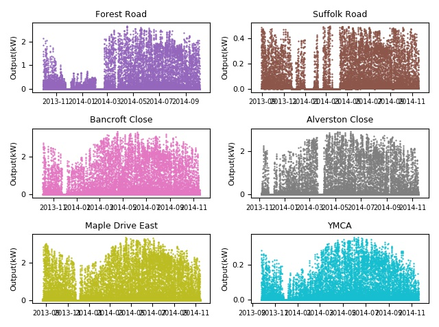
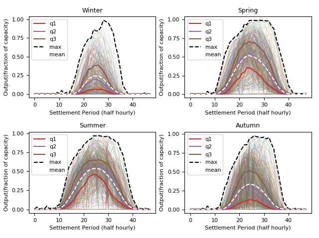
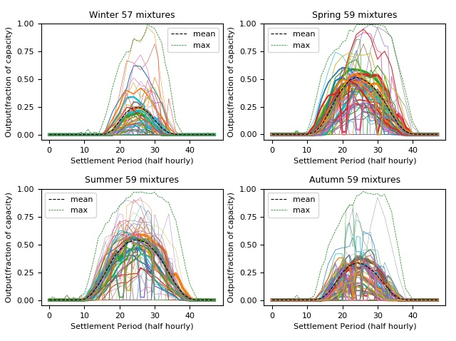
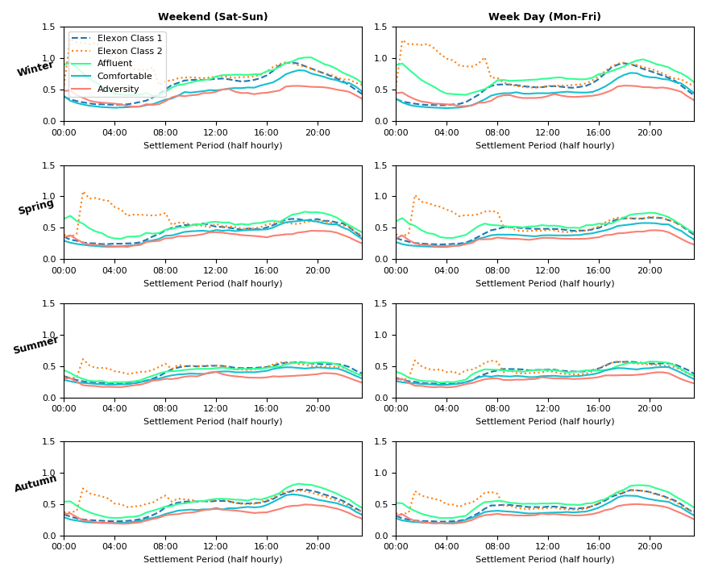
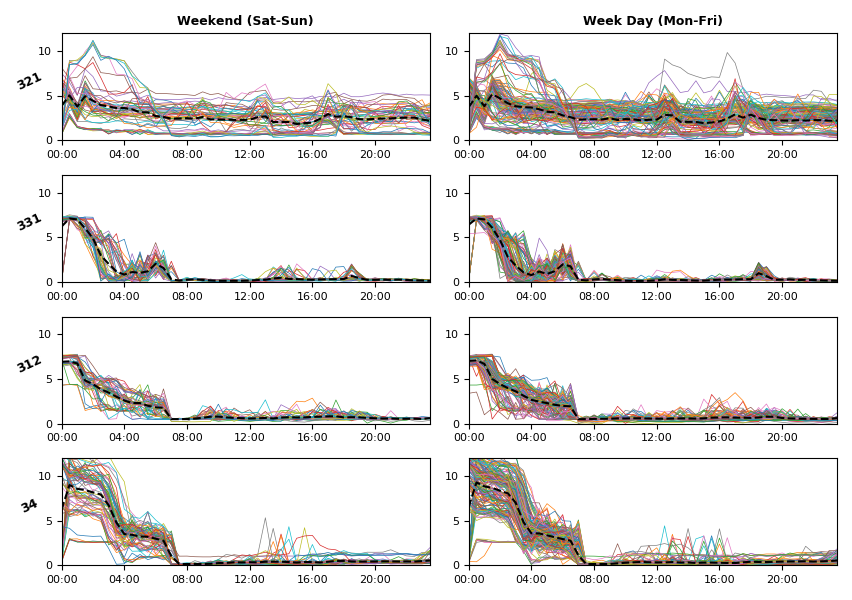
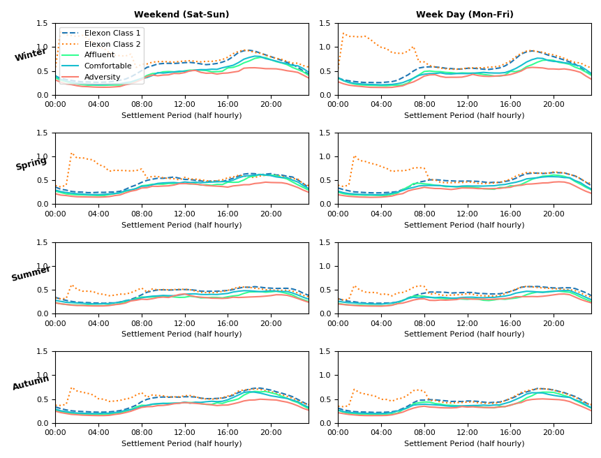
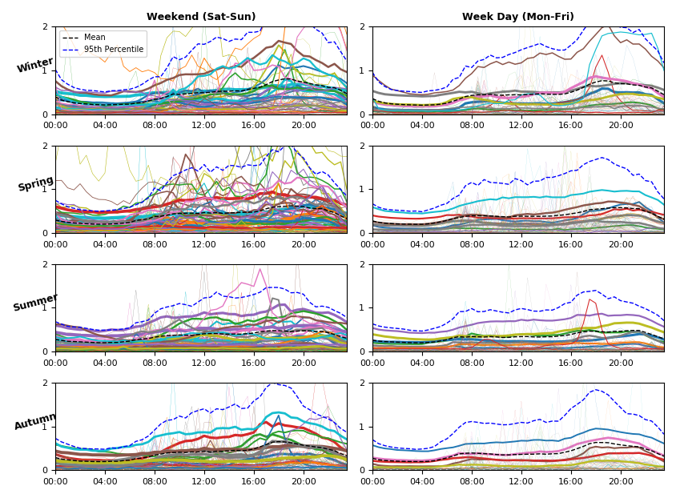
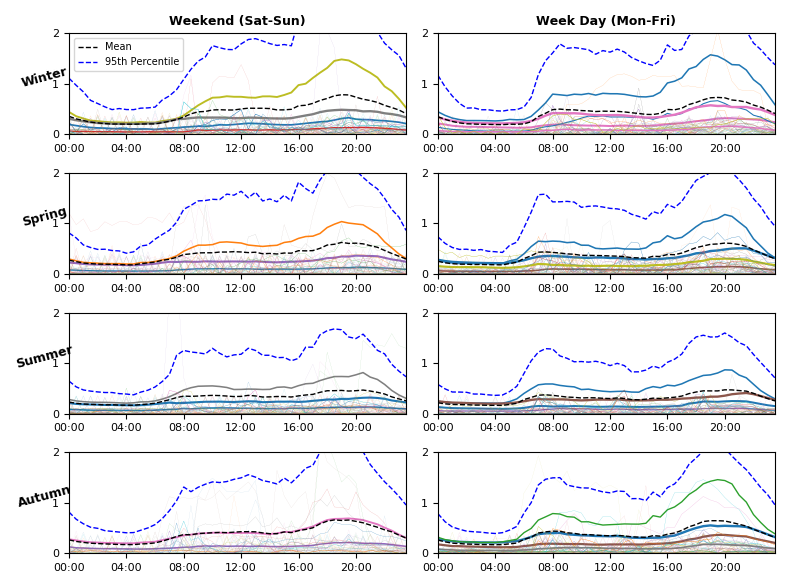
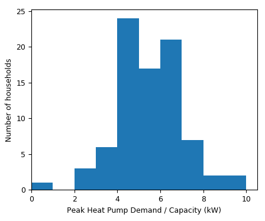

# Data Input Descriptors

This folder contains Scripts to process data inputs to the AGILE model
Data inputs include the following
- [PV](#pv): London Datastore for 6 PV sites over ~400 days
- [Smart Meter](#smart-meter): London Datastore for 184 customers over ~650 days
- [Heat Pump](#heat-pump): London Datastore 
- Electric Vehicle: Electric nation

## PV 

The script 'PVLoad.py' is used to process PV data for the AGILE Model. The raw data can be found in 'HourlyPV.csv'.
The London DataStore PV data is used from: https://data.london.gov.uk/dataset/photovoltaic--pv--solar-panel-energy-generation-data
Hourly Data is used and interpolated to half hourly. (Only 4 months of data was available for 10-minutely and 1-minutely)

Data is available for the Following sites and Data ranges:

Site | Apparent capacity (kW) | Date Range
-----|------------------------|-----------
Forest Road | 3.00 | 2013-10-01 to 2014-10-03 (366 Days)                 
Suffolk Road | 0.50 | 2013-08-28 to 2014-11-09 (448 Days)
Bancroft Close | 3.50 | 2013-10-04 to 2014-11-17 (408 Days)
Alverston Close | 3.00 | 2013-11-06 to 2014-11-14 (372 Days)
Maple Drive East | 4.00 | 2013-08-21 to 2014-11-13 (448 Days)
YMCA | 0.45 | 2013-09-25 to 2014-11-19 (420 Days)

The script 'PV_Load.py' creates 4 pickle files with the data processed:
    
- 'PV_BySiteName.pickle' - Which contains output (kW and Normalised by capacity) datestamped with a dataframe for each site
- 'PV_Normalised.pickle' - Which has normalised output by season in rows of 48 half hours combined for all sites with timestamps removed.

Furthermore, in the script 'PV_Mixtures', Gaussian mixture models (GMMs) are fitted to the data in 'PV_Normalised'. 

This produces the following pickle files which contain GMMs by season:

- 'PV_DistsGMMChosen.pickle' - Mean of normalised output each mixture. e.g. for 50 mixtures then there will be 50 rows of 48 half hours.
- 'PV_DistsGMMWeights.pickle' - Weighting for each mixture. e.g. for 50 mixtures there will be 50 probabilities, adding up to 1.

These are shown in [PV Gaussian Mixture models](#pv-gaussian-mixture-models).

The script 'PVLoad.py' also plots the data both by site and by season. Some of the displays are shown below.

### PV Data Visualisation

#### Timeseries by Site

**Figure 1:** PV output timeseries by Site

#### Daily profile by Season (all sites)

**Figure 2:** PV output (all sites) by Season

#### PV Gaussian Mixture Models

Using the daily seasonal profiles above, Gaussian Mixture models can be fitted to the data to allow multivariate sampling.

The number of mixtures has been chosed by minimising the Aikaike Information Criterion, which leads to a large number of mixtures up to the limit of 60 chosen.

The means of the seasonal Gaussian mixture models can be seen below. The line weightings represent the weightings applied to each mixture (i.e. the probability of each mixture being chosen for sampling)

**Figure 3:**  PV Mixture Models

## Smart Meter

The London DataStore (or Low Carbon London (LCL)) Smart Meter data is used from: https://data.london.gov.uk/dataset/smartmeter-energy-use-data-in-london-households .

There is a data for 5,500 customers, a random 184 customers are chosen for sampling to keep data manageable size.
From Files:
- 'Power-Networks-LCL-June2015(withAcornGps)v2_1.csv'
- 'Power-Networks-LCL-June2015(withAcornGps)v2_2.csv'
- 'Power-Networks-LCL-June2015(withAcornGps)v2_10.csv'
- 'Power-Networks-LCL-June2015(withAcornGps)v2_11.csv'
- 'Power-Networks-LCL-June2015(withAcornGps)v2_100.csv'
- 'Power-Networks-LCL-June2015(withAcornGps)v2_101.csv'

Some example analysis of the data is found https://data.london.gov.uk/blog/electricity-consumption-in-a-sample-of-london-households/ .
The data for the 184 Households used in Agile is summarised below, by Acorn Group:

Acorn Group|Number of customers| Avg Days of Data (per customer)| Average Peak Demand (kW)| Average Daily Demand (kWh/day) | Average demand (kW)
-----------|-------------------|--------------------------------|------------------|-------------------------------|--------------------
Adversity | 54 | 670|3.88|8.04|0.33
Comfortable | 46 | 655|4.62|9.62|0.40
Affluent | 84 |679|5.58|12.87| 0.54

The smart meter dates per customer ranges between 06/12/2011 up to 28/02/2014.
However complete data for most customers is available between 06/2012 and 06/2013.

The script creates 4 pickle files with the data processed:
    
- "SM_DataFrame.pickle" - Smart meter raw data for 187 Smart meters (subset of the 5,500 LCL customers).Timestamped
- "SM_Summary.pickle" - Summary of Acorn Group, Date Ranges and Means/Peaks for each household
- 'SM_DistsByAcorn_NH' Costumers by acorn group with overnight heating demand removed
- "SM_Consolidated_NH.pickle" - Customers are combined into Seasonal (and weekday/weekend) daily profiles by ACorn Group, Heating demand removed

Furthermore, in the script 'SM_Mixtures', Gaussian mixture models (GMMs) are fitted to the data in 'SM_Consolidated_NH'. 

This produces the following pickle files which contain GMMs by season:

- 'SM_DistsGMMChosen.pickle' - Mean of each demand mixture. e.g. for 50 mixtures then there will be 50 rows of 48 half hours.
- 'SM_DistsGMMWeights.pickle' - Weighting for each mixture. e.g. for 50 mixtures there will be 50 probabilities, adding up to 1.

These are shown in [Smart Meter Gaussian Mixture models](#smart-meter-gaussian-mixture-models).

### Smart meter Data Visualisation

#### Seasonal Mean Demand by Acorn Group

The daily mean demand (kW) profiles for the subset of 184 househoulds, categorised by Season, weekend/weekday and Acorn Group (Adversity, Comfortable, Affluent) is shown below:

Elexon average customer demand profiles from https://www.elexon.co.uk/operations-settlement/profiling/ are superimposed for comparison. 
Class 1 customers are Domestic Unrestricted Customers and Class 2 customers are Domestic Economy 7 Customers which would typically include overnight storage heating and hot water.

**Figure 4:**  Smart Meter Daily Profiles by Acorn Group (Means) 

#### Customers with storage heating
From Inspection there are unexpected peaks in the winter demand from midnight till around 4am. This suggests controlled storage heating and/or water heating.
As Heat pump demand is to be added to customers base load, it is important to separate customers with electric heating, so that
heat demand is not added twice to any customers.

The winter daily profiles of some of the Customers with the highest overnight and 4pm demand are shown below. These are all Affluent type customers with high annual demands, 
amongst the highest of the sample set, of up to 10,000 kWh/year. As a reference, the Ofgem Typical Domestic Consumption Values (TCVD) for a high user 
of electricity on Economy 7 Tariff (as customers with storage heating typically are), is 7,100 kWh/year.

**Figure 5:**  Smart Meter Customers with Storage Heating 

y axis is demand in kW, y labels are the customer ID

#### Demand profiles with high overnight demand removed

Customers with demands above 1000kWh/year in the hours of midnight to 2am were removed. This removed 23 customer profiles with 162 remaining.

3 Adversity and 20 Affluent customers were removed. The remaining customers are summarised as follows;

Acorn Group|Number of customers| Avg Days of Data (per customer)| Average Peak Demand (kW)| Average Daily Demand (kWh/day) | Average demand (kW)
-----------|-------------------|--------------------------------|------------------|-------------------------------|--------------------
Adversity | 50 | 662 | 3.76 | 7.63 | 0.32
Comfortable | 46 | 655 | 4.62 | 9.62 | 0.40
Affluent | 66 | 666 | 4.58 | 8.94 | 0.37

As can be seen from the table above and the mean daily demand profiles below. There is now little difference between Affluent and Comfortable customers in terms of demand.

In fact Comfortable customers now have a higher average daily demand and peak. This highlights the significant effect the 20 high demand Affluent customers had on the averaged data.

The demand in the LCL subset is lower than the Elexon class 1 and class 2 profiles. Therefore heat pump and EV demand can be added with some confidence that there is not already a
significant amounts already there.

**Figure 6:**  Smart Meter Daily profiles with heating costomers removed 

#### Smart Meter Gaussian Mixture Models

Using the daily seasonal profiles per Acorn Group above, Gaussian Mixture models can be fitted to the data to allow multivariate sampling.

The number of mixtures has been chosed by minimising the Aikaike Information Criterion, which leads to a large number of mixtures up to the limit of 80 chosen.

The means of the seasonal Gaussian mixture models for the Comfortable Acorn group can be seen below. The line weightings represent the weightings applied to each mixture (i.e. the probability of each mixture being chosen for sampling).

**Figure 7:**  Smart Meter Gaussian mixtures: Comfortable acorn group

The mixtures for the Comfortable Acorn group show that they capture some of the variation up to and above the 95th percentile. In the case of smart meter data, to capture the outliers (small number of points up to 8kW)
would require a large number of mixtures. A limitation of using the means of gaussian mixtures is that these outliers are not captured although they are very unfrequent, which is why the mixture model does not fit to them.

This is particularly the case for the Affluent mixtures (shown below), particularly in Summer week days, where there are very few fits to data above the mean, due to less variation in demand profiles than in the weekend.

**Figure 8:**  Smart Meter Gaussian mixtures: Adversity acorn group

## Heat Pump

Heat pump data is taken from the UK governmoent Renewable Heat Premium Payment Scheme: https://beta.ukdataservice.ac.uk/datacatalogue/studies/study?id=8151&type=data%20catalogue

Lowe, R., Department of Energy and Climate Change. (2017). Renewable Heat Premium Payment Scheme: Heat Pump Monitoring: Cleaned Data, 2013-2015. [data collection]. UK Data Service. SN: 8151, http://doi.org/10.5255/UKDA-SN-8151-1

Data is available for 700 heat pumps between October 2013 and March 2015  (although the heat pumps dont all have data for the date entire range).

For AGILE the data has been filtered by Domestic Air Source heat pumps (many of the heat pumps were ground source and for social landlords) which took the 
dataset down to 84 customers.

The capacities of the heat pumps have been inferred by the maximum power drawn. Note: the data is supplied 2 minutely, therefore
capacities calculated from 2mins are higher than those averaged over 30mins. In this work the 30min capacity is used along with the
power averaged over 30mins. The powers calculated over 2 mins and 3 mins are shown below:

kW|Weight
--|------
3|0.05
4|0.07
5|0.29
6|0.21
7|0.25
8|0.08
9|0.03
10|0.03

**Figure 9:**  Heat pump capacity histogram - 2 mins

**Figure 10:**  Heat pump capacity histogram - 30 mins