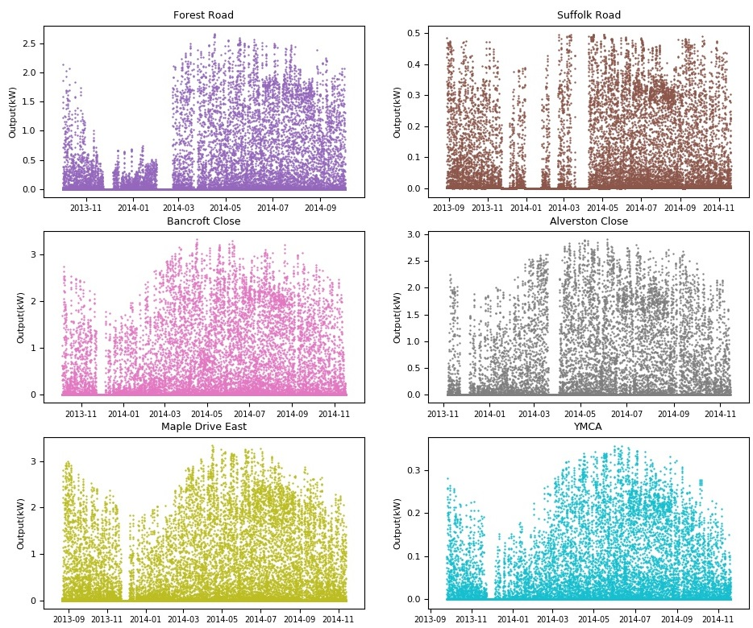
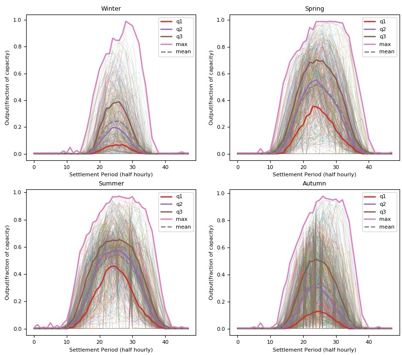

# Data Input Descriptors

This folder contains Scripts to process data inputs to the AGILE model
Data inputs include the following
- PV: London Datastore for 6 PV sites over ~400 days
- Smart Meter: London Datastore for ~50 customers over X days
- Heat Pump: London Datastore 
- Electric Vehicle: Electric nation

## PV 

The script 'PVLoad.py' is used to process PV data for the AGILE Model. The raw data can be found in 'HourlyPV.csv'.
The London DataStore PV data is used from: https://data.london.gov.uk/dataset/photovoltaic--pv--solar-panel-energy-generation-data
Hourly Data is used and interpolated to half hourly. (Only 4 months of data was available for 10-minutely and 1-minutely)

Data is available for the Following sites and Data ranges:

Site | Apparent capacity (kW) | Date Range
-----|------------------------|-----------
Forest Road | 3.00 | 2013-10-01 to 2014-10-03 (366 Days)                 
Suffolk Road | 0.50 | 2013-08-28 to 2014-11-09 (448 Days)
Bancroft Close | 3.50 | 2013-10-04 to 2014-11-17 (408 Days)
Alverston Close | 3.00 | 2013-11-06 to 2014-11-14 (372 Days)
Maple Drive East | 4.00 | 2013-08-21 to 2014-11-13 (448 Days)
YMCA | 0.45 | 2013-09-25 to 2014-11-19 (420 Days)

The script 'PVLoad.py' creates 2 pickle files with the data processed:
    
- 'PV_BySiteName.pickle' - Which contains output (kW and Normalised by capacity) datestamped with a dataframe for each site
- 'PV_Normalised.pickle' - Which has normalised output by season in rows of 48 half hours combined for all sites with timestamps removed.

The script 'PVLoad.py' also plots the data both by site and by season. Some of the displays are shown below.

### PV Data Visualisation

Timeseries by Site

Daily profile by Season (all sites)

Using the daily seasonal profiles above, Gaussian Mixture models can be fitted to the data to allow multivariate sampling.

The means of the seasonal Gaussian mixture models can be seen below. The line weightings represent the weightings applied to each mixture (i.e. the probability that would be used for choosing one of the mixtures for sampling)

