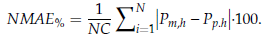
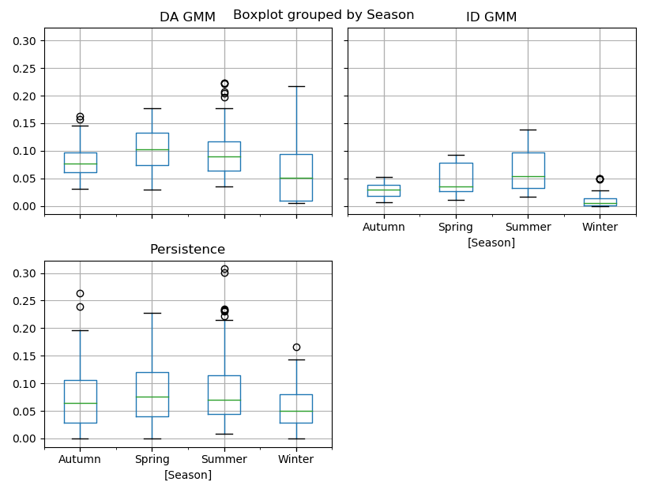

# Forecasting

This folder contains Scripts to produce forecasts for the AGILE model.

Data inputs include the following. See the 'Data' Folder in the main repository for more details
on how the data was used to produce distributions and gaussian mixture models.
- [PV](#pv-forecasting): London Datastore for 6 PV sites over ~400 days
- Smart Meter: London Datastore for 184 customers over ~650 days
- Heat Pump: London Datastore 
- Electric Vehicle: Electric nation

## PV forecasting

The script 'forecasting.py' produces forecasts of output from PV.

The function 'Forecast' uses persistence forecast using a previous days data then fits gaussian mixtures (GMM) to produce a best fit Day Ahead forecast that 
can be benchmarked against the persistence forecast. Both are a form of persistence forecast as they use the previous days output.

The Day Ahead (DA) forecast is refined using the first 10 hours of actual data (i.e. at 10am) to produce an Intraday (ID) forecast.

Below is the Day Ahead forecast for the 8 days from 2/7/2014 using data from the previous day to form the DA forecast. 

The forecasts are for the site 'Averston Close' which was removed from the training data to allow it to be used for testing.

**Figure 1:** Alverston Close PV Day Ahead forecast 

As the outputs are already normalised we can express the error as the Normalised Mean Absolute Error (NMAE);

where: NC- Capacity, N-half hours, Pm,h-Measured output, Pp,h - Predicted

The average Day Ahead persistence NMAE across all 8 of the days above is 13.6%, and the Day Ahead weighted gaussian mixture NMAE, which is created from the persistence forcast is 12.9%.

The highest Day Ahead persistence and GMM error comes on Day 1 which has no output. Day 2 also has a very high error as it is using Day 1's output (of 0) to as its estimate when there was in fact a very high output on Day 2.

The intraday forecasts estimated using the first 10 hours of daily output, are vital on Days 1 and 2 for correcting this Day Ahead error, these are given below:

**Figure 2:** Alverston Close PV intraday forecast

The average Intraday GMM forecast NMAE across all sites is 9.5%. The Intraday GMM provides an improved forecast than the Day Ahead on these 8 days,
The intraday forecast is most useful for capturing days with no output as occured on Day 1 where the error is reduced from 24.3% to 10% from DA to ID.

### PV Forecasting Error Box Plots

The forecast error is calculated over a year to give the range of expected error. This is done for Alverston Close using the same methodology as above, from the dates 7/11/2013 to 12/11/2013.

The Mean Absolute Errors for day ahead persistence and gaussian mixture model (GMM) as well as the GMM intraday mean errors are as follows;

Method | Normalised Mean Absolute Error (%)
-------|--------------------
DA Persistence| 7.59
DA GMM| 7.59
DA ID| 6.7

In terms of NMAE the GMM performs exactly the same as the persistence forecast for DA. An obvious improvement would be to use weather forecasts (irradiance or temperature), however the level of accuracy using GMM is sufficient and the gains to be made from improving the method may not warrant the effort involved.

The range of possible errors for each method is shown by season in the box plots below. 

**Figure 3:** Mean Absolute Error for forecasting methods by season

Again there is little to choose between the Persistence and GMM forecasts.

The Intraday GMM forecast has tighter error distributions particularly in summer where the maximum error is 14% compared to over 20% for the Day ahead methods. Given that PV output is at its highest in Summer, this improved intraday forecast will be particularly useful in reducing uncertainty of network congestion caused by high PV output.

### PV error timeseries

