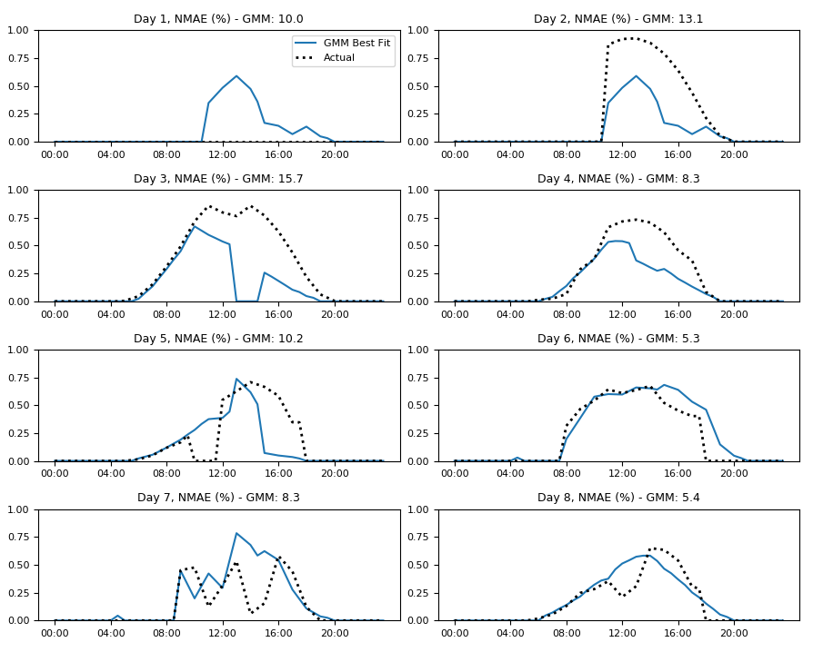

# Forecasting

This folder contains Scripts to produce forecasts for the AGILE model.

Data inputs include the following. See the 'Data' Folder in the main repository for more details
on how the data was used to produce distributions and gaussian mixture models.
- [PV](#pv-forecasting): London Datastore for 6 PV sites over ~400 days
- Smart Meter: London Datastore for 184 customers over ~650 days
- Heat Pump: London Datastore 
- Electric Vehicle: Electric nation

## PV forecasting

The script 'forecasting.py' produces forecasts of output from PV.

The function 'Forecast' uses persistence forecast using a previous days data then fits gaussian mixtures (GMM) to produce a best fit Day Ahead forecast that 
can be benchmarked against the persistence forecast. Both are a form of persistence forecast as they use the previous days output).

The Day Ahead (DA) forecast is refined using the first 10 hours of actual data (i.e. at 10am) to produce an Intraday (ID) forecast.

Below is the Day Ahead forecast for the 8 days from 2/7/2014 using data from the previous day to form the DA forecast. 

The forecasts are for the site 'Averston Close' which was removed from the training data to allow it to be used for testing.

**Figure 1:** Alverston Close PV Day Ahead forecast 

The average Day Ahead persistence Mean Absolute Error (MAE) across all 8 of the days above is 0.136, and the Day Ahead weighted gaussian mixture MAE, which is created from the persistence forcast is 0.111.

The highest Day Ahead persistence and GMM error comes on Day 1 which has no output. Day 2 also has a very high error as it is using Day 1's output (of 0) to as its estimate when there was in fact a very high output on Day 2.

The intraday forecasts estimated using the first 10 hours of daily output, are vital on Days 1 and 2 for correcting this Day Ahead error, these are given below:

**Figure 2:** Alverston Close PV intraday forecast

The average Intraday GMM forecast MAE across all sites is 0.076. The Intraday GMM provides an improved forecast than the Day Ahead on these 8 days,
The intraday forecast is most useful for capturing days with no output as occured on Day 1 where the error is reduced from 0.228 to 0.047 from DA to ID.

