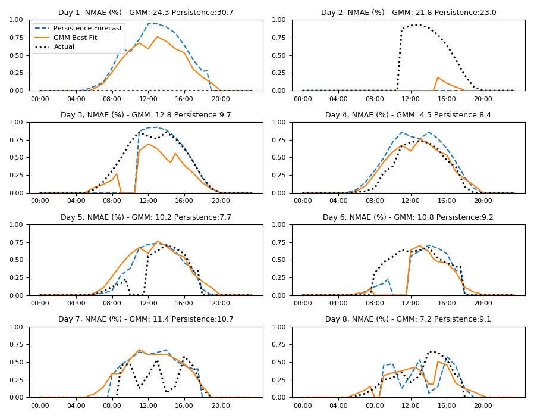

# Forecasting

This folder contains Scripts to produce forecasts for the AGILE model.

Data inputs include the following
- [PV](#pv-forecasting): London Datastore for 6 PV sites over ~400 days
- Smart Meter: London Datastore for 184 customers over ~650 days
- Heat Pump: London Datastore 
- Electric Vehicle: Electric nation

## PV forecasting

The script 'forecasting.py' produces forecasts of output from PV.

The function 'Forecast' uses persistence forecast using a previous days data
then fits gaussian mixtures to produce a range of probable Day Ahead forecasts that 
can be benchmarked against the persistence forecast (previous days output).

The day ahead forecast is refined using the first 10 hours of actual data (i.e. at 10am)
to produce an intraday forecast.

Below is the day ahead forecast for the 2/7/2014 using data from the day before (1/7/2014).

**Figure 1:** PV day ahead forecast 

The average Day ahead persistence NMAE across all sites is 0.091, and the Day Ahead weighted gaussian mixture NMAE, which is created from the persistence forcast for 2/7/2014 is 0.079. 

The highest day ahead error comes for Alverston Close which has no output on the 2/7/2014. 

The intraday forecasts estimated using the first 10 hours of daily output are given below:

The average Intraday gaussian mixture model forecast NMAE across all sites is 0.06. However in most cases the NMAE is worse using the best fit intraday forecast than the day ahead,
The intraday forecast is most useful for capturing days with no output as occured in Alverston Close.

**Figure 2:** PV intraday forecast

