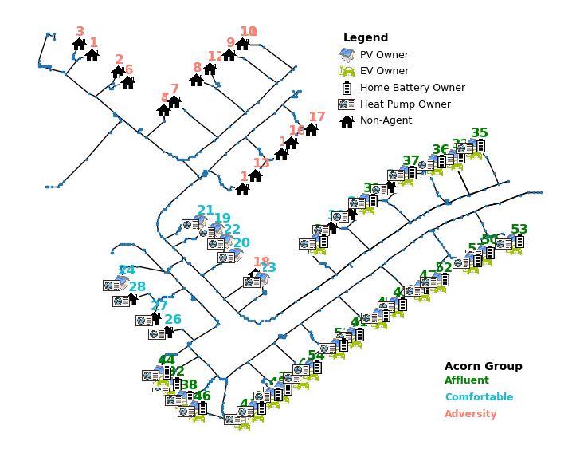
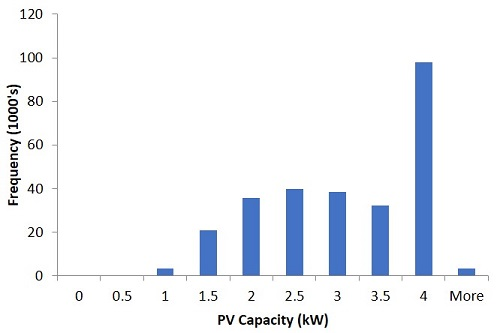
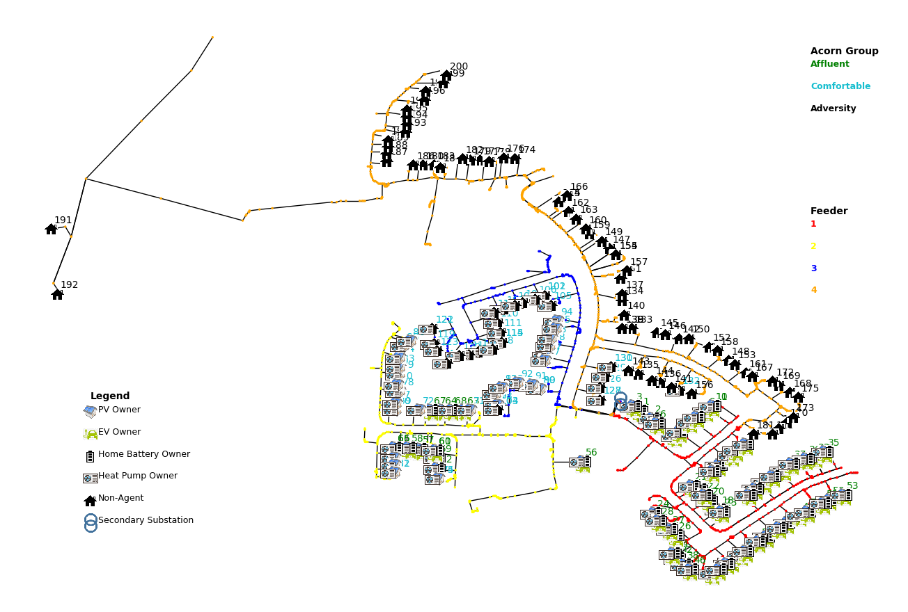

# Agile Flex

## Test Feeder

Network 17 has been chosen due to having the most customers (883). With a large variation in loads between feeders (from 8 to 188) and a high Feeder cable supply rating (400 A). Mid level phase imbalance.

Network 5 has been chosen due to having a low Feeder supply cable rating (71 A to 240 A), medium number of customers (335), large variation in customer numbers between feeders (4,18,156,30,49,17,23,38). Phases are well balanced.

Network 10 has a small number of customers (64) with a high cable supply rating (355 A to 400 A). Medium spread across feeders, phases well balanced.

Network 18 is mid range. Medium supply cable rating (from 200 A to 400 A) , 328 customers spread fairly evenly across 9 feeders and well balanced across phases.

The test feeder used to demonstrate the AGILE aggregation model is the Low Voltage Network Solutions (LVNS) Network 1 Feeder 1. https://www.enwl.co.uk/zero-carbon/innovation/smaller-projects/low-carbon-networks-fund/low-voltage-network-solutions/

The feeder has 55 customers spread across the 3 phases. Flexibility is assigned as per Acorn Group.

Based on the Low Carbon London data for london customers, https://data.london.gov.uk/blog/electricity-consumption-in-a-sample-of-london-households/,
there is a roughly even spread of households per acorn group (with slightly more Adversity customers).

The test network has a slightly higher share of Affluent customers to represent a feeder with higher LCT uptage as follows;

- Affluent (24 Customers): are assumed to be full adopters of Low carbon technologies, all have Heat Pumps, Electric Vehicles, PV and Home Batteries.
- Comfortable (18 Customers): half of these are assumed to have PV and all are assumed to have heat pumps.
- Adversity (17 Customers): are assumed to not have any low carbon technologies (LCTs) due to the high capital costs required.

The network schematic is shown below:

**Figure 1:** Feeder Map with customers and LCT technologies

### PV Capacity Distribution

The PV distribution of PV capacities has been calculated from the distribution of installed PV capacities with Feed in tariffs in the UK.

This is reported by Ofgem in https://www.ofgem.gov.uk/environmental-programmes/fit/contacts-guidance-and-resources/public-reports-and-data-fit/installation-reports
The installation report for January 2020 is used and filtered by Domestic PV. The resulting histogram is shown below:

**Figure 2:** PV capacity histogram

This translates to the following capacities and weights. 

kW|Weight
--|------
1 |.01
1.5 |0.08
2|0.13
2.5|0.15
3|0.14
3.5|0.12
4|0.37

The 1% of installations above 4kW are mostly 10kW installations and are not included:

### Customer Summary Table

The details of each of the 55 customers is listed below, including acorn group, coordinates (X,Y), Phase, and LCT capacity.

|   ID |   Node |   Agent | Acorn Group   |   X |   Y |   Phase |   Home Battery kW |   Home Battery kWh |   EV Charger Size kW |   EV Battery Size kWh |   PV kW |   Heat Pump kW |
|------|--------|---------|---------------|-----|-----|---------|-------------------|--------------------|----------------------|-----------------------|---------|----------------|
|    1 |    134 |0 | Adversity     | 372 | 155 |1 |0 |0   | 0   |    0 |     0   |0 |
|    2 |    147 |0 | Adversity     | 380 | 149 |2 |0 |0   | 0   |    0 |     0   |0 |
|    3 |    170 |0 | Adversity     | 368 | 159 |1 |0 |0   | 0   |    0 |     0   |0 |
|    4 |    173 |0 | Adversity     | 394 | 135 |1 |0 |0   | 0   |    0 |     0   |0 |
|    5 |    174 |0 | Adversity     | 394 | 135 |1 |0 |0   | 0   |    0 |     0   |0 |
|    6 |    183 |0 | Adversity     | 383 | 145 |2 |0 |0   | 0   |    0 |     0   |0 |
|    7 |   1178 |0 | Adversity     | 397 | 138 |2 |0 |0   | 0   |    0 |     0   |0 |
|    8 |   1208 |0 | Adversity     | 404 | 146 |3 |0 |0   | 0   |    0 |     0   |0 |
|    9 |   1225 |0 | Adversity     | 414 | 155 |1 |0 |0   | 0   |    0 |     0   |0 |
|   10 |   1248 |0 | Adversity     | 418 | 159 |2 |0 |0   | 0   |    0 |     0   |0 |
|   11 |   1249 |0 | Adversity     | 418 | 159 |2 |0 |0   | 0   |    0 |     0   |0 |
|   12 |   1264 |0 | Adversity     | 408 | 150 |3 |0 |0   | 0   |    0 |     0   |0 |
|   13 |   1276 |0 | Adversity     | 422 | 111 |2 |0 |0   | 0   |    0 |     0   |0 |
|   14 |   1289 |0 | Adversity     | 418 | 106 |1 |0 |0   | 0   |    0 |     0   |0 |
|   15 |   1314 |0 | Adversity     | 430 | 119 |2 |0 |0   | 0   |    0 |     0   |0 |
|   16 |   1320 |0 | Adversity     | 433 | 123 |3 |0 |0   | 0   |    0 |     0   |0 |
|   17 |   1327 |0 | Adversity     | 439 | 128 |3 |0 |0   | 0   |    0 |     0   |0 |
|   18 |   1337 |0 | Adversity     | 422 |  75 |3 |0 |0   | 0   |    0 |     0   |0 |
|   19 |   1342 |1 | Comfortable   | 410 |  91 |3 |0 |0   | 0   |    0 |     4   |4 |
|   20 |   1349 |1 | Comfortable   | 416 |  82 |1 |0 |0   | 0   |    0 |     4   |4 |
|   21 |   1387 |1 | Comfortable   | 405 |  94 |1 |0 |0   | 0   |    0 |     1.5 |4 |
|   22 |   1388 |1 | Comfortable   | 413 |  87 |1 |0 |0   | 0   |    0 |     4   |4 |
|   23 |   1406 |1 | Comfortable   | 424 |  73 |2 |0 |0   | 0   |    0 |     1   |4 |
|   24 |   1458 |1 | Comfortable   | 381 |  72 |3 |0 |0   | 0   |    0 |     3.5 |4 |
|   25 |   1502 |0 | Comfortable   | 451 |  97 |1 |0 |0   | 0   |    0 |     0   |4 |
|   26 |   1522 |0 | Comfortable   | 395 |  54 |2 |0 |0   | 0   |    0 |     0   |4 |
|   27 |   1539 |0 | Comfortable   | 391 |  59 |3 |0 |0   | 0   |    0 |     0   |4 |
|   28 |   1556 |0 | Comfortable   | 384 |  66 |3 |0 |0   | 0   |    0 |     0   |4 |
|   29 |   1562 |0 | Comfortable   | 463 | 107 |1 |0 |0   | 0   |    0 |     0   |4 |
|   30 |   1563 |0 | Comfortable   | 445 |  92 |1 |0 |0   | 0   |    0 |     0   |4 |
|   31 |   1611 |1 | Affluent      | 456 | 102 |1 |5 | 13.5 | 7.4 |   40 |     1   |5 |
|   32 |   1614 |1 | Affluent      | 396 |  35 |3 |5 | 13.5 | 7.4 |   40 |     2   |5 |
|   33 |   1619 |1 | Affluent      | 483 | 118 |3 |5 | 13.5 | 7.4 |   40 |     2   |5 |
|   34 |   1629 |1 | Affluent      | 441 |  87 |1 |5 | 13.5 | 7.4 |   40 |     2   |5 |
|   35 |   1639 |1 | Affluent      | 489 | 122 |2 |5 | 13.5 | 7.4 |   40 |     2   |5 |
|   36 |   1676 |1 | Affluent      | 477 | 116 |2 |5 | 13.5 | 7.4 |   40 |     4   |5 |
|   37 |   1682 |1 | Affluent      | 468 | 112 |2 |5 | 13.5 | 7.4 |   40 |     3   |5 |
|   38 |   1688 |1 | Affluent      | 400 |  30 |2 |5 | 13.5 | 7.4 |   40 |     1   |5 |
|   39 |   1701 |1 | Affluent      | 430 |  33 |3 |5 | 13.5 | 7.4 |   40 |     2   |5 |
|   40 |   1702 |1 | Affluent      | 436 |  38 |2 |5 | 13.5 | 7.4 |   40 |     4   |5 |
|   41 |   1755 |1 | Affluent      | 452 |  53 |2 |5 | 13.5 | 7.4 |   40 |     3   |5 |
|   42 |   1778 |1 | Affluent      | 427 |  31 |3 |5 | 13.5 | 7.4 |   40 |     4   |5 |
|   43 |   1780 |1 | Affluent      | 465 |  64 |3 |5 | 13.5 | 7.4 |   40 |     3   |5 |
|   44 |   1785 |1 | Affluent      | 393 |  39 |2 |5 | 13.5 | 7.4 |   40 |     2   |5 |
|   45 |   1813 |1 | Affluent      | 460 |  60 |2 |5 | 13.5 | 7.4 |   40 |     2   |5 |
|   46 |   1817 |1 | Affluent      | 404 |  26 |1 |5 | 13.5 | 7.4 |   40 |     3   |5 |
|   47 |   1835 |1 | Affluent      | 473 |  70 |3 |5 | 13.5 | 7.4 |   40 |     1   |5 |
|   48 |   1860 |1 | Affluent      | 418 |  23 |1 |5 | 13.5 | 7.4 |   40 |     2   |5 |
|   49 |   1861 |1 | Affluent      | 422 |  26 |1 |5 | 13.5 | 7.4 |   40 |     4   |5 |
|   50 |   1886 |1 | Affluent      | 492 |  83 |2 |5 | 13.5 | 7.4 |   40 |     2   |5 |
|   51 |   1896 |1 | Affluent      | 447 |  49 |1 |5 | 13.5 | 7.4 |   40 |     2   |5 |
|   52 |   1898 |1 | Affluent      | 478 |  73 |1 |5 | 13.5 | 7.4 |   40 |     3   |5 |
|   53 |   1899 |1 | Affluent      | 501 |  87 |2 |5 | 13.5 | 7.4 |   40 |     2   |5 |
|   54 |   1900 |1 | Affluent      | 439 |  41 |1 |5 | 13.5 | 7.4 |   40 |     1   |5 |
|   55 |   1906 |1 | Affluent      | 488 |  80 |1 |5 | 13.5 | 7.4 |   40 |     2   |5 |

## Network 1

The test Network used to demonstrate the AGILE aggregation model is the Low Voltage Network Solutions (LVNS) Network 1.

The feeder has 200 customers spread across 4 feeders on the 3 phases. Flexibility is assigned as per Acorn Group;

- Affluent (68 Customers): are assumed to be full adopters of Low carbon technologies, all have Heat Pumps, Electric Vehicles, PV and Home Batteries.
- Comfortable (66 Customers): half of these are assumed to have PV and all are assumed to have heat pumps.
- Adversity (66 Customers): are assumed to not have any low carbon technologies (LCTs) due to the high capital costs required.

Customers are dispersed by feeder and phase as follows;

|Feeder|Phase 1|Phase 2|Phase 3| Total
|------|-------|-------|-------|------ 
|1|21|19|15|55
|2|11|11|9|31
|3|14|12|13|39
|4|28|26|21|75
|Total|74|68|58|200

In terms of customer type:

|Affluent|P1|P2|P3|Comfortable|P1|P2|P3|Adversity|P1|P2|P3|
|--------|--|--|--|-----------|--|--|--|---------|--|--|--| 
|1|21|19|15|1|0|0|0|1|0|0|0
|2|7|4|2|2|4|7|7|2|0|0|0
|3|0|0|0|3|14|12|13|3|0|0|0
|4|0|0|0|4|4|3|0|4|24|23|21

The network schematic is shown below:

**Figure 3:** Network 1 Map with customers and LCT technologies